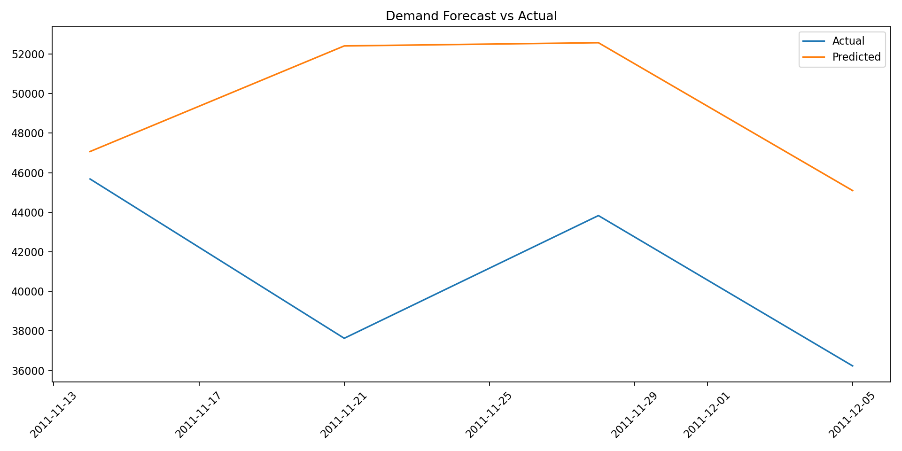
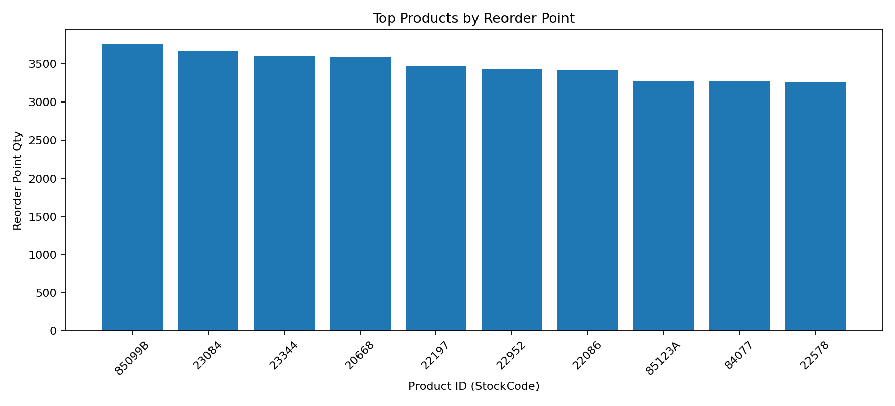

# Zalando Demand Forecasting

## 1. Problem
E-commerce retailers like Zalando need accurate demand forecasts to avoid stockouts and excess inventory. This project predicts product demand and translates predictions into inventory decisions (reorder point, safety stock, and target stock level).

## 2. Dataset
This project uses the Online Retail transaction dataset (`data/raw/processed/online_retail_data.csv`), which contains:
- Transaction/invoice records
- Product IDs (`StockCode`)
- Product descriptions
- Timestamps (`InvoiceDate`)
- Quantity sold (`Quantity`)
- Price and country

## 3. Methodology
Pipeline:

Data Cleaning  
↓  
Feature Engineering  
↓  
Demand Forecasting Model  
↓  
Model Evaluation  
↓  
Inventory Optimization

Implementation details:
- Cancellation/return filtering and invalid-row cleanup
- Weekly aggregation by `StockCode` and `Country`
- Lag, rolling, price, and seasonality features
- Random Forest global model
- Backtesting on recent holdout weeks
- Service-level-based inventory policy

## 4. Results
Latest evaluation metrics from `reports/metrics.json`:
- MAE: **253.99**
- RMSE: **398.26**
- WMAPE: **0.61**

### Forecast vs Actual


Plot source file:
- `reports/forecast_actual_vs_predicted.csv` with columns `WeekStart`, `actual`, `prediction`

### Top Products by Reorder Point


## 5. Business Impact
The system generates demand forecasts and converts them into operational inventory actions:
- Reorder points for replenishment triggers
- Safety stock buffers based on uncertainty and service level
- Target stock levels for planning cycles

This directly supports supply chain planning and reduces risk of lost sales from stockouts.

## 6. Repository Structure

```text
zalando-demand-forecasting
│
├── data
│   └── raw/processed/online_retail_data.csv
│
├── notebooks
│   ├── 01_data_cleaning.ipynb
│   ├── 02_model_training.ipynb
│   └── 03_forecast_visualization.ipynb
│
├── src
│   ├── data_processing.py
│   ├── train_model.py
│   ├── forecast.py
│   ├── inventory.py
│   └── demand_inventory_system.py
│
├── api
│   └── app.py
│
├── models
│   ├── demand_model.joblib
│   └── model_metadata.json
│
├── reports
│   ├── backtest_predictions.csv
│   ├── demand_forecast.csv
│   ├── inventory_recommendations.csv
│   ├── metrics.json
│   └── figures
│       ├── forecast_plot.png
│       └── inventory_reorder_top10.png
│
├── requirements.txt
└── README.md
```

## Run

```bash
python3 src/demand_inventory_system.py \
  --input data/raw/processed/online_retail_data.csv \
  --output-dir reports \
  --model-dir models \
  --top-series 300 \
  --n-estimators 20
```

Or use one-command workflows:

```bash
make install
make train
make viz
make api
```

Dashboard:

```bash
make dashboard
```

## Notebook Visualization

Open and run:
- `notebooks/03_forecast_visualization.ipynb`

It reads report CSVs and saves:
- `reports/figures/forecast_plot.png`
- `reports/figures/inventory_reorder_top10.png`

## Optional API

Run FastAPI app:

```bash
uvicorn api.app:app --reload
```

Example request:
- `/predict?product_id=85123A`

## Streamlit Dashboard

Run:

```bash
streamlit run app/dashboard.py
```

Features:
- Select product-country series
- View forecast curve and forecast table
- View inventory recommendation metrics (reorder point, safety stock, target inventory)
- View global actual vs predicted backtest chart
